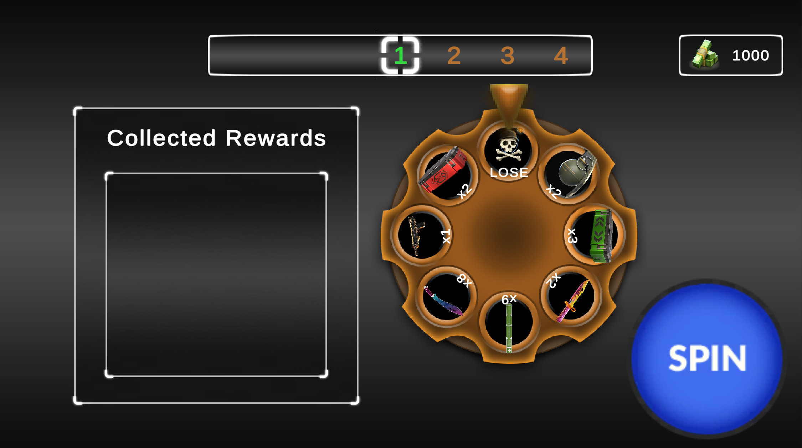
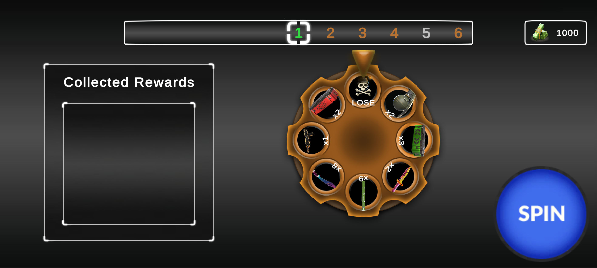
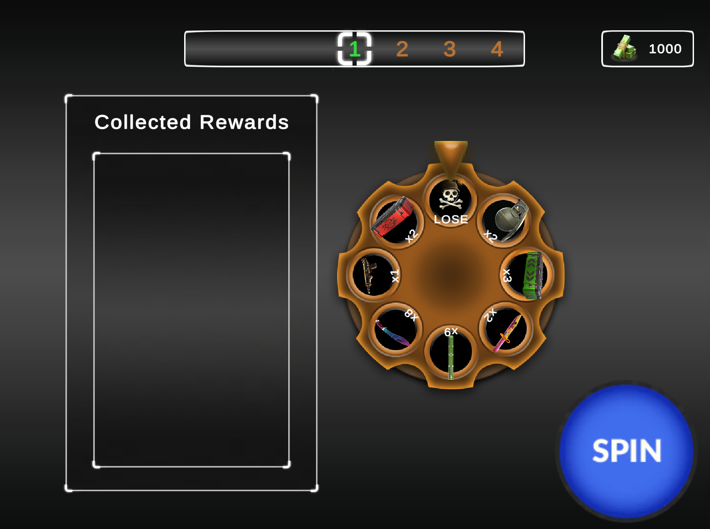

# Wheel of Fortune

A wheel spinning game created as part of the Vertigo Games Game Developer Demo.

The goal is to keep spinning to increase your rewards, or walk away before a bomb takes everything.

---

## Gameplay

Each zone contains a wheel made up of reward slices and a single bomb slice.

Landing on a reward adds it to your current stash and advances you to the next zone.

Landing on a bomb gives you the lose condition, however you can return.

At any safe checkpoint, the player can choose to leave and secure their rewards instead of risking another spin.

The player by default starts with 0 rewards collected, displayed on the left of the screen, and 1000 cash, displayed on the top right of the screen.

### Safe Zones

Every 5th zone is a Safe Zone.

* No bomb slice
* Silver-themed wheel
* Guaranteed reward
* Opportunity to end the run safely

### Super Zones

Every 30th zone is a Super Zone.

* No bomb slice
* Golden-themed wheel
* Exclusive high-multiplier rewards
* Safe reward collection point

### Respawning

When a bomb is hit, the player gets the lose condition screen. However, they have an amount of cash they can spend to keep playing from the Zone they hit the bomb in, rather than going back to Zone 1.

The cash reward increments everytime the player revives themselves, but resets upon collecting or giving up rewards and going back to Zone 1.

---

# Gameplay Video

---

# Screenshots

## 16:9

## 20:9

## 4:3

---

# Features

* Configurable wheel reward pools for each reward type directly from the Unity Editor
* Safe Zone progression system
* Super Zone progression system
* Risk / reward gameplay loop
* Respawn flow
* Animated wheel spins
* Animated reward collecting mechanism
* Responsive UI supporting multiple aspect ratios

---

# Technical Notes

### Wheel Configuration

Wheel slices are data-driven and can be modified from the editor without code changes.

Different wheel setups are used for:

* Normal Zones
* Safe Zones
* Super Zones

### Animation

The project uses DOTween for:

* Wheel spin animations
* Rewards being chosen feedback
* Rewards being put to the inventory animation

### UI

The interface was built to support:

* 20:9
* 16:9
* 4:3

in landscape mode without requiring separate layouts.

---

# Build

The latest (v1.1) Android build can be found in the Releases section of this repository.

APK is in the release file.
